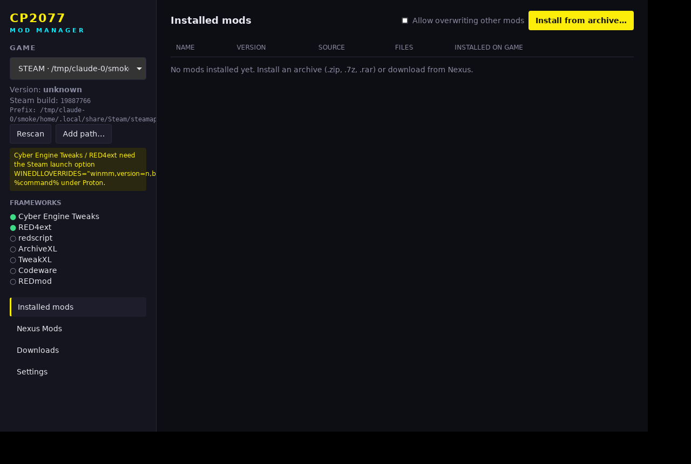

# CPMX2077

CPMX2077 is a Linux-native mod manager for Cyberpunk 2077 running under Proton (Steam) or
Heroic (GOG), shipped as an AppImage.

Download the AppImage from [Releases](https://github.com/EkranoplanCC/LinuxCPMX2077/releases),
make it executable (`chmod +x`) and run it. A Windows installer
(`CPMX2077_<version>_x64-setup.exe`) is built too; see [Windows](#windows-preview).



## What it does

- **Finds the game**: scans every Steam library (native, Flatpak, Snap) and
  Heroic's GOG installs, reads the Steam build id and the executable's version,
  locates the Proton prefix, and detects CET, RED4ext, redscript, ArchiveXL,
  TweakXL, Codeware and REDmod.
- **Linux setup, fixed for you**: checks what mods need from Proton/Wine and
  fixes it after one confirmation, each with an Undo: installs the Visual C++
  2015-2022 runtime into the prefix (`vcrun2022` via protontricks, or
  winetricks with the game's own Proton/Wine build), sets Steam's launch
  options (`WINEDLLOVERRIDES="winmm,version=n,b" %command%`, plus `-modded`
  for REDmod; only while Steam is closed), sets the same DLL overrides in a
  Heroic prefix, and merges mod folders that exist under two spellings.
  Installing a mod that needs one of these asks to set it up straight away.
- **Tracks everything** in a SQLite library (`~/.local/share/cp2077-modmanager/`):
  each mod, its source, the game build it was installed on, the archive's
  SHA-256/MD5, and every file it put into the game with its SHA-256.
- **Installs archives** (`.zip`, `.7z`; `.rar` via system `bsdtar`/`unrar`)
  the way each mod expects:
  - **FOMOD installers** run as an in-app wizard: steps, option groups and
    their pick-one/pick-any rules, recommended/required/not-usable options
    (including ones that depend on files already in the game, e.g. "needs
    CET"), condition flags, hidden steps, conditional files and priorities.
    Installer images are shown; UTF-16 XML is handled.
  - Game-root layouts (even wrapped in a folder): CET, RED4ext, redscript,
    ArchiveXL/TweakXL, `engine/` configs.
  - Standalone CET mod folders (with `init.lua`) go to
    `bin/x64/plugins/cyber_engine_tweaks/mods/`.
  - REDmod folders (`info.json` + `archives/`, `scripts/`, …) go to `mods/`,
    with `-modded` added to the launch options by the Linux setup.
  - Loose `.archive` / `.xl` / `.reds` / tweak files.
- **Conflicts**: refuses to overwrite another mod's files unless you allow it;
  uninstalling the winner restores the loser's copy, and original game files
  are backed up and restored.
- **Switching versions**: installing another version of an installed mod
  (from an archive, the Downloads tab, Nexus or GitHub) replaces it in place:
  the old files come out, the new ones go in, and a disabled mod stays
  disabled. It counts as the same mod when it comes from the same GitHub
  repository, or installs some of the same files and comes from the same
  Nexus page, has the same name apart from version numbers, or mostly
  overlaps. An optional file from the same Nexus page that shares no files
  with the main one is installed next to it.
- **Modpacks tab**: browse and search Nexus collections, open one to see
  which of its mods you have, which are missing, turned off or on another
  version, and install the missing ones through the download queue.
  Installing from a collection follows it: "Check for updates" asks Nexus
  for new revisions, and opening one shows what the new revision adds,
  changes and drops, with one button to update. Your own categories (with
  colors) sort installed mods your way and stay with a mod through updates.
  "Export mod list" saves your mods, categories and followed collections to
  a JSON file; "Import mod list" applies its categories and offers to get
  the mods you don't have.
- **Dependencies**: "Show dependencies" in Installed mods lists what each mod
  needs indented under it, from its Nexus page and from the frameworks its
  files use (redscript for `.reds`, ArchiveXL for `.xl`, …), marked
  installed, turned off, already in the game folder or missing, with a button
  to get what's missing, plus which mods need it.
- **Enable/disable** without uninstalling: switching a mod off takes its files
  out of the game (bringing back whatever they replaced) and keeps a checked
  copy, so switching it on again needs no re-download. Files the mod changed
  after install, such as its own settings, stay in place and are kept when it
  comes back. Disabled mods are left out of the compatibility check and crash
  analysis.
- **Diagnostics tab**: one place for overview and diagnosis. It opens with a
  summary of what needs attention (game setup warnings, recent crashes, mods
  named in log errors, compatibility problems), followed by the graph, the
  compatibility findings and the crash/log check. “Show in graph” next to a
  finding or a crash suspect lights up the mods involved and what they share.
- **Compatibility check** (no AI needed): every enabled mod is indexed for
  what it touches: game resources inside `.archive` files (and which of them
  replace base-game resources), redscript `@replaceMethod`/`@wrapMethod`/
  `@addField`/`@addMethod`, TweakXL records and properties, ArchiveXL resource
  patches, CET `Override`/`Observe` hooks and RED4ext plugins. Diagnostics
  lists hard clashes, overlaps (with which archive wins the
  load order) and frameworks a mod needs that aren't installed.
- **Agent access (read-only MCP)**: `CPMX2077_<version>_amd64.AppImage --mcp`
  serves the mod list, file hashes, the compatibility index and the game's
  logs to an agent such as Claude Code
  (`claude mcp add cp2077-mods -- /path/to/AppImage --mcp`). The database is
  opened read-only, there are no tools that change or run anything, and logs
  are only readable from a fixed list of known locations.
- **Crashes & logs**: reads the game's crash reports in the Proton prefix
  (`REDEngine/ReportQueue`), the CET, RED4ext, ArchiveXL, TweakXL, Codeware and
  redscript logs (plus per-mod CET logs and Proton's `steam-1091500.log`),
  lists errors and warnings, and names the installed mod each one mentions.
- **Graph view**: mods, the frameworks they need, the game classes, tweak
  records and resources they touch, with clashes highlighted.
- **Verify**: re-hashes a mod's files and reports missing, edited or
  overridden ones.
- **Nexus Mods sign-in**: “Sign in with Nexus Mods” uses Nexus SSO, so you
  log in on nexusmods.com in your browser and the app receives an API key; your
  password never goes through the app. Pasting a personal API key works too.
  Keys live only in the system keyring (Secret Service), never in a file.
- **Browse Nexus Mods in the app**: search by name, sort by best match,
  endorsements, downloads or date (paged), and open Nexus' Trending, Latest
  added and Latest updated lists. A mod's page shows its description as plain
  text, stats and files grouped as on the website (old versions folded away),
  with mods you already have marked “installed”. Adult-flagged mods are hidden
  unless you turn them on in Settings.
- **Nexus downloads**: Premium accounts download and install straight from a
  mod's file list. Free accounts click “Get from Nexus”: the file's page opens
  in a Nexus window inside the app, you sign in and click “Slow download”
  there yourself, and the app catches the `nxm://` link the page sends and
  downloads, verifies and installs the file. Nexus doesn't let free accounts
  download through its API, so that one click on their page is required. “Or
  use your browser” opens the page in your normal browser instead; the app
  offers to register itself as the `nxm://` handler first (also in
  Settings). Pasting a mod URL, ID or `nxm://` link still works.
- **GitHub as a second source**: the core frameworks (CET, RED4ext,
  redscript, ArchiveXL, TweakXL, Codeware) and many mods ship as GitHub
  releases. Switch “Get mods” to GitHub to search, or paste `owner/repo` or a
  repository URL, see its releases and download an asset. A download is only
  accepted from GitHub's own hosts and must match the SHA-256 digest GitHub
  publishes for the asset; it then goes through the same installer. Sources
  sit behind one `ModSource` interface (`crates/core/src/sources/`), so more
  can be added. Release lists are cached for 10 minutes to stay within
  GitHub's 60 requests an hour without a token, so a brand-new release can
  take that long to show up.
- **Download queue**: “Select” on the Get mods page lets you pick many mods,
  then “Download all” queues them. GitHub mods and Premium Nexus downloads run
  straight through. For a free account one Nexus window steps through the
  file pages in turn (“Mod 3 of 12”): you click the download button on each,
  and the app downloads and installs that mod in the background while moving
  on to the next page. Skip and Cancel are in the window's “Download queue”
  menu and in the queue panel. Update all uses the same queue.
- **Categories, versions and updates**: the Installed tab can be filtered by
  category and sorted by name, category, version or source. Downloads show
  the mod version, the game version they were downloaded on, the source and
  how the file was verified. “Check for updates” (also run at start-up) asks
  Nexus and GitHub for newer files; outdated mods get an Update button in the
  Installed and Downloads tabs, and an update replaces the old version in
  place.
- **API quota**: the app reads Nexus' `X-RL-*` rate-limit headers, shows how
  many requests are left, stops sending when Nexus says the quota is used up
  (or returns 429) until it resets, and pauses browsing when fewer than 25
  requests remain so downloads and checksum checks still work. Lists and mod
  pages are cached for a few minutes.

### Windows (preview)

Linux is the main target; the Windows build is an early preview working
towards full support. Run `CPMX2077_<version>_x64-setup.exe` from Releases.
It installs for your user only (no admin rights) and isn't code-signed yet,
so SmartScreen asks once: More info, Run anyway. What differs from Linux:

- **Finding the game**: Steam via the registry and its library folders, GOG
  Galaxy via the registry, and the Epic Games launcher's install manifests.
  Picking the folder by hand works as on Linux.
- **No Linux setup panel**: the game runs natively, so there's no prefix,
  runtime or DLL override to fix. Install the Visual C++ runtime yourself if
  CET or RED4ext ask for it.
- **API key** is kept in Windows Credential Manager.
- **`nxm://` links**: installing doesn't take them over from Vortex or Mod
  Organizer. “Handle nxm:// links” in Settings points them at CPMX2077 (a
  per-user registry entry).
- **Crash reports** are read from `%LOCALAPPDATA%\REDEngine\ReportQueue`.
- **`.rar` archives** use the `tar.exe` that ships with Windows 10 and 11.
- The library lives in `%APPDATA%\cp2077-modmanager\`.

Not yet tested on a real Windows machine: CI builds and lints the Windows
code, but the unit tests run on Linux only.

### Nexus SSO slug

Nexus only allows browser sign-in for applications it has registered, and
identifies them by a slug. Once Nexus issues one, either build with
`NEXUS_SSO_APP_SLUG=<slug>` or enter it under Settings. Until then the API key
field is the way to connect.

## Download safety

- Archive formats are identified by magic bytes, never by extension.
- Entry names with `..`, absolute paths, drive letters, `:` or NUL are
  rejected; symlink entries are refused; extraction writes with `create_new`
  and checks every parent directory resolves inside the target.
- Entry count and *actual* decompressed bytes are capped (zip-bomb defence);
  any failure deletes the partial extraction.
- Files are deployed with atomic temp-file + rename and never written through
  symlinks in the game directory.
- Nexus downloads are only fetched over HTTPS from `nexusmods.com` /
  `nexus-cdn.com` (redirects included), must match the advertised size, and
  their MD5 must be recognised by Nexus for that exact mod and file, otherwise
  the file is discarded.
- GitHub downloads are only fetched over HTTPS from `github.com` and its
  release-asset hosts and must match the asset's published SHA-256 digest.
  Older assets without a digest are marked unverified.
- The in-app Nexus window has no access to the app's commands. It only hands
  over `nxm://` links; links to other sites open in your browser.

## Building

```sh
# Debian/Ubuntu
sudo apt install libwebkit2gtk-4.1-dev libgtk-3-dev librsvg2-dev libayatana-appindicator3-dev libssl-dev patchelf
cargo install tauri-cli --version "^2" --locked

cargo test --workspace
cd src-tauri && cargo tauri build --bundles appimage
```

On Windows (with the WebView2 runtime, which Windows 10 and 11 include), run
`cargo tauri build --bundles nsis` in `src-tauri`; the installer lands in
`target/release/bundle/nsis/`.

The AppImage lands in `target/release/bundle/appimage/`. CI builds it on every
push (see `.github/workflows/build.yml`). Pushing a version tag that matches
the version in `src-tauri/tauri.conf.json` (e.g. `v0.1.0`), or running the
workflow from the Actions tab with "release" ticked, publishes the AppImage
and the Windows installer as a release with a SHA256SUMS file.

## Layout

- `crates/core` – all logic (detection, database, extraction, install, Nexus
  client, secrets); no GUI dependency, fully unit-tested.
- `src-tauri` – Tauri 2 shell exposing core functions as commands.
- `ui` – plain HTML/CSS/JS frontend (no build step).

## Roadmap

- A one-click list of the core frameworks from GitHub
- Load order for `.archive` files
