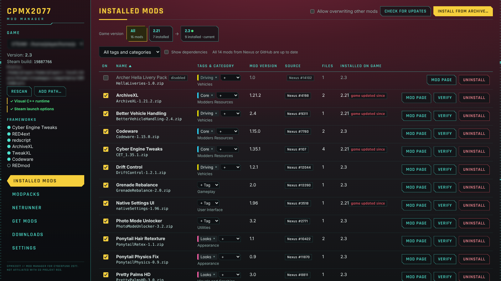
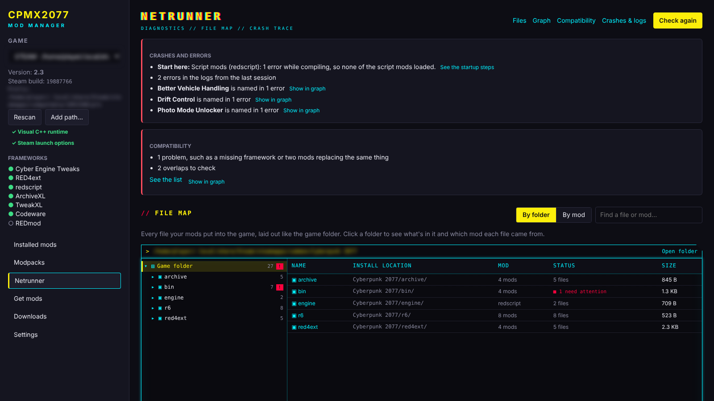
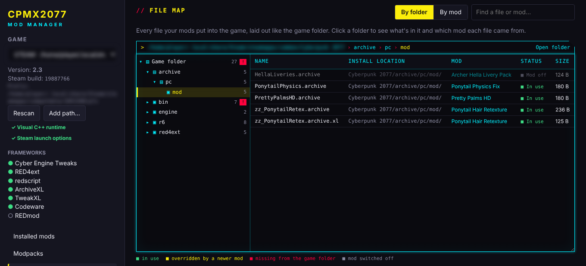
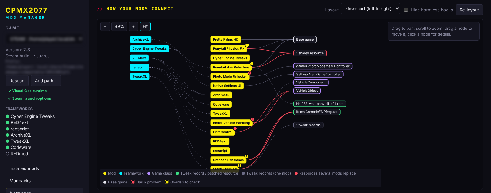
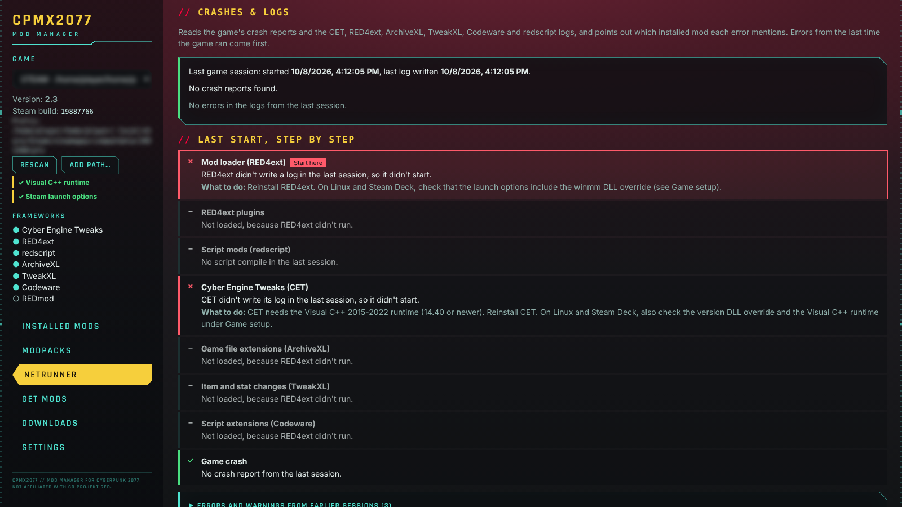
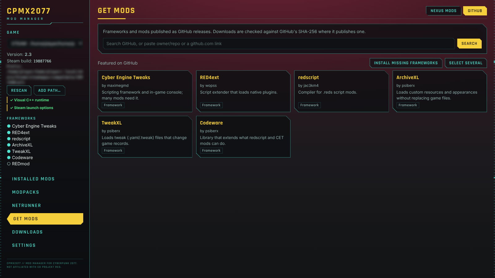

# CPMX2077 user guide

A reference for how CPMX2077 works and what each part of the window does.
New here? Start with [Getting started](getting-started.md). Screenshots
show sample data, with file locations blurred.

- [How it works](#how-it-works)
- [Game panel](#game-panel)
- [Installed mods](#installed-mods)
- [Modpacks](#modpacks)
- [Netrunner](#netrunner)
- [Get mods](#get-mods)
- [Downloads](#downloads)
- [Settings](#settings)
- [Download safety](#download-safety)
- [Letting Claude look at your mods (MCP)](#letting-claude-look-at-your-mods-mcp)
- [Where things are stored](#where-things-are-stored)
- [Troubleshooting](#troubleshooting)

## How it works

CPMX2077 installs mods straight into the game folder, the way the mods'
authors describe, and remembers every file it put there.

1. **Get an archive**: from Nexus Mods, from a GitHub release, or a `.zip`,
   `.7z` or `.rar` you already have. Downloads are verified before anything
   is unpacked (see [Download safety](#download-safety)) and kept in the
   download folder, one folder per mod.
2. **Work out the layout**: the archive is unpacked into a staging folder
   and the app decides where each file goes:
   - a **FOMOD installer** runs as a wizard where you pick options;
   - files already laid out like the game folder (`bin/`, `archive/`,
     `r6/`, `red4ext/`, `engine/`, `mods/`) go where they say, even inside
     an extra wrapper folder;
   - a CET mod folder (with `init.lua`) goes to
     `bin/x64/plugins/cyber_engine_tweaks/mods/`;
   - a REDmod folder (`info.json` plus `archives/`, `scripts/`, …) goes to
     `mods/`;
   - loose `.archive`, `.xl`, `.reds` and tweak files go to their usual
     folders, loose `.ini` files to `engine/config/platform/pc/`, and ReShade
     presets to `bin/x64/`;
   - an archive holding alternative packs (for example several presets)
     asks which one you want in a **Versions** step;
   - readmes and screenshots are skipped, and downloads that are not game
     mods (only documents, a script, or a standalone program such as a save
     editor) are refused with a message saying why.
3. **Deploy**: each file is written with a safe temp-file-and-rename. If a
   file belongs to another mod, the install stops unless you tick **Allow
   overwriting other mods**. Original game files that get replaced are backed
   up first.
4. **Record**: the library database stores the mod, its source, version,
   the game build it was installed on, the archive's checksums and every
   installed file with its SHA-256. A staged copy of the mod is kept so it
   can be switched off and on again without downloading.
5. **Index**: every enabled mod is scanned for what it touches (game
   resources in `.archive` files, redscript methods, TweakXL records,
   ArchiveXL patches, CET hooks, RED4ext plugins). This index drives the
   compatibility check, the graph and the dependency list.

Uninstalling reverses step 3: the mod's files are removed, a file another
mod had installed underneath comes back, and backed-up game files are
restored.

Installing another version of a mod you have replaces it in place: the old
files come out, the new ones go in, and a disabled mod stays disabled. It
counts as the same mod when it comes from the same GitHub repository, or
when it installs some of the same files and comes from the same Nexus page,
has the same name apart from version numbers, or mostly overlaps. An
optional file from the same Nexus page that shares no files with the main
one is installed next to it instead.

## Game panel

The left-hand panel shows the install the rest of the app works on.

- **Game drop-down**: every install found. Steam libraries (native, Flatpak
  and Snap Steam) and Heroic's GOG installs are scanned. **Rescan** looks
  again; **Add path…** adds a game folder by hand.
- **Version, Steam build, Prefix**: read from the game's executable, Steam's
  manifest and the Proton prefix location.
- **Linux setup items**: what mods need from Proton/Wine, each with a fix
  button and, after a fix, **Undo**. Every fix asks for confirmation first,
  and the app offers fixes on its own after you install a mod that needs one.
  - *Visual C++ runtime* → **Install vcrun2022** (protontricks, Flatpak
    protontricks, or winetricks with the game's own Proton).
  - *Steam launch options* → **Set launch options** writes
    `WINEDLLOVERRIDES="winmm,version=n,b" %command%` (plus `-modded` when
    REDmod mods are installed). Only works while Steam is closed. **Copy**
    copies the option to paste yourself.
  - *DLL overrides* (Heroic) → **Set overrides** sets `winmm` and `version`
    to native-then-builtin in the prefix.
  - *Folder names* → **Merge folders** joins mod folders that exist under two
    spellings.
- **Frameworks**: CET, RED4ext, redscript, ArchiveXL, TweakXL, Codeware and
  REDmod, highlighted when present in the game folder.

## Installed mods



The list of mods CPMX2077 installed in the selected game.

| Column / control | What it does |
|---|---|
| **On** switch | Turns a mod off without uninstalling it: its files leave the game, whatever they replaced comes back, and a checked copy is kept. Turning it on puts them back without a download. Files the mod changed after install (its own settings) are kept. Disabled mods are left out of compatibility and crash checks. |
| **Name / Category / Mod version / Source** | Click a heading to sort. **Mod version** is the mod's own version (the game version is under **Installed on game**). The category picker sets one of your own categories (see [Modpacks](#modpacks)); the Nexus category is shown under it. |
| **Installed on game** | The game version when the mod went in. *game updated since* means the game has been patched since, so check the mod still works. |
| **Update to …** | Appears when a newer file is available. *Switch to stable …* appears when you run a pre-release and a stable release is out. |
| **Mod page** | Opens the mod's page in **Get mods** (description, files, requirements), for mods from Nexus or GitHub. From there **Open on nexusmods.com** opens the website. Not shown for mods installed from an archive on disk. |
| **Verify** | Re-hashes the mod's files and reports missing, edited or overridden ones. |
| **Uninstall** | Removes the mod and restores what it replaced. |

Above the list:

- **Allow overwriting other mods**: lets the next install replace files that
  belong to another mod. Uninstalling the winner later restores the loser's
  copy.
- **Check for updates** asks Nexus and GitHub for newer files (also runs at
  start-up). **Update all** queues every available update.
- **Install from archive…** installs a `.zip`, `.7z` or `.rar` from disk.
- **Game version ribbon**: one chip per game version the app has seen. Pick
  one to list the mods installed on it. For an older version, a summary shows
  what you had when the game updated and what changed since (updated, turned
  off, removed, added).
- **Category filter**: your own categories and Nexus categories.
- **Show dependencies** lists what each mod needs, indented under it: its
  Nexus page's requirements and the frameworks its files use (redscript for
  `.reds`, ArchiveXL for `.xl`, …). Each is marked installed, turned off,
  already in the game folder, or missing, with a button to get it (**Turn
  on**, **Install** from GitHub, **Get from Nexus**, or **Open link** for
  off-site requirements). The requirements come from each mod's Nexus page,
  asked again once a day, so a requirement you have never installed still
  shows up as missing. A requirement hosted outside Nexus whose presence
  can't be checked is marked **not verified**. A mod with nothing found in
  either source shows "No requirements listed on its Nexus page; no
  framework use found in its files" (or "No Nexus page to read requirements
  from" for mods not installed from Nexus). The line next to the checkbox counts what is missing
  for your turned-on mods, and **Get missing (N)** queues all of it at once:
  core frameworks from GitHub, everything else from Nexus.

## Modpacks

Nexus collections, your own categories, and mod list import/export. Needs a
connected Nexus account for collections.

- **Search collections**: search Cyberpunk 2077 collections and sort by most
  endorsed, most downloaded, best rated, recently updated or newest.
- **Open a collection** to see each of its mods marked as installed, missing,
  turned off, or a different file than the collection lists. Then:
  - **Install required mods** queues the missing required ones;
  - **Install all, with optional** also queues optional ones;
  - a button replaces mods you have on another version with the file the
    collection lists;
  - **Follow** tracks the collection without installing anything;
    **Open on nexusmods.com** opens its page.
  Mods the collection lists from outside Nexus are named so you can get them
  by hand. Collection load order and bundled settings files are not applied
  yet.
- **Collections you follow**: installing from a collection follows it.
  **Check for updates** asks Nexus for new revisions; **See what changed**
  shows what a revision adds, changes and drops, with one button to update.
  **Stop following** leaves its mods installed.
- **Your categories**: add categories with a name and color, rename or
  delete them. Assign them in Installed mods. They stay with a mod through
  updates.
- **Export mod list…** saves your mods, categories and followed collections
  to a JSON file. **Import mod list…** reads one, adds its categories and
  offers to get the mods you don't have.

## Netrunner



One place to see whether your setup is healthy (called Diagnostics in
earlier versions). **Check again** reruns every check. The top of the
tab summarises what needs attention: game setup problems, where the last
start went wrong (**Start here**), whether the game crashed in the last
session, errors from that session, known problem mods, and compatibility
problems. **Show in
graph** next to a finding lights up the mods involved. The links under the
title (**Files**, **Graph**, **Compatibility**, **Crashes & logs**) jump to
each section.

### File map



Every file your mods put into the game, laid out like the game folder, in
the style of a registry editor. Folders are on the left: click one to open
it and see what's inside on the right, or use the arrow keys (up and down to
move, right to open, left to close). The bar above shows where you are;
click any part of it to go back up, and **Open folder** opens that folder in
your file manager.

Each file shows its name, **Install location** (the folder it sits in inside the
game folder; click it to open that folder, hover for the full path), the
**Mod** it came from, its **Status** and its size:

- **In use**: the file is in the game folder and this mod's copy is the one
  the game loads.
- **Overridden by …**: a newer mod installed the same file over this one.
  Uninstalling or turning off the newer mod brings this copy back.
- **Missing**: the mod is on, but the file is gone from the game folder
  (deleted by hand or by another tool). **Verify** in Installed mods
  checks it in detail; reinstalling the mod puts it back.
- **Mod off**: the mod is switched off, so its files are kept outside the
  game until you turn it on again.

A red **!** next to a folder means something inside it is missing or
overridden. **By folder** / **By mod** switches between the game's folder
layout and one branch per mod (click a mod name in the list to jump to its
branch). **Find a file or mod…** lists every file whose path or mod name
matches. The map only shows files CPMX2077 installed, not the game's own
files or mods installed by hand.

### Graph



How your mods connect: mods, the frameworks they need, game classes, tweak
records and resources they touch, and the base game. Clashes are drawn in
red.

- **Layout**: *Web* (force layout) or *Flowchart* (left to right).
- **Hide harmless hooks** hides hooks that several mods share without
  conflict.
- Drag to pan, scroll or use the zoom bar (− / 100% / + / **Fit**), drag a
  node to move it, click a node for its details. **Re-layout** starts over.

### Compatibility

Lists, by severity:

- **Problems**: clashes where only one mod can win, such as two mods
  replacing the same redscript method, or a framework a mod needs that isn't
  installed.
- **Overlaps to check**: resources or tweak values several mods change, with
  which archive wins the load order.
- **Shared hooks (chained, all run)**: several mods hook the same function.
  Hooks are chained, so every one runs; they only clash if they change the
  same return value.

**Show what's affected** lists the exact resources or records. Base-game
resources are shown by hash. *What each mod changes* is a per-mod summary
table. No AI is involved: this is a local index of the mods' files.

### Crashes & logs



Reads the crash reports in the Proton prefix (`REDEngine/ReportQueue`), the
CET, RED4ext, ArchiveXL, TweakXL, Codeware and redscript logs, per-mod CET
logs and Proton's `steam-1091500.log`.

- **Last game session.** The top card says when the game last started,
  when it last wrote a log, and whether it crashed. CPMX2077 works this out
  from the time stamps in the RED4ext, CET and redscript logs.
- **Last start, step by step.** One line per stage of a modded start, in the
  order the game runs them: *Mod loader (RED4ext)*, *RED4ext plugins*,
  *Script mods (redscript)*, *Cyber Engine Tweaks (CET)*, *Game file
  extensions (ArchiveXL)*, *Item and stat changes (TweakXL)*, *Script
  extensions (Codeware)* and *Game crash*. Each shows ✓ (fine), ! (worth a
  look), ✗ (failed), – (didn't run) or ○ (not installed), the installed
  version, the mods involved and **What to do**. The first failed step is
  marked **Start here**: errors after it usually follow from it. For example,
  if the RED4ext log stops at "Loading plugin from …", the game died while
  loading that plugin, and the step names the mod that installed it.
  **Log lines** shows the lines behind the result.
- **Known problems.** Mods and setups the modding wiki's troubleshooting
  guide warns about, each with what to do and **Read more on the modding
  wiki**: cybercmd next to RED4ext, CTD Helper, NPCs Gone Wild, System-Ex,
  Respector, the old Material and Texture Override, KSUV and VTK together, two
  copies of Virtual Atelier, a `modlist.txt` that changes the archive load
  order, ReShade or OptiScaler files, more than about 460 mods, and a script
  mod installed twice.
- **Errors and warnings from the last session** come first, each matched to
  the installed mod it mentions, with the time it was written. Known messages
  (for example `EXCEPTION_ACCESS_VIOLATION`, `Gpu Crash`, "Failed to resolve
  address for hash" or a script error) get a plain explanation and **What to
  do**. Script errors keep the line that says what went wrong. Harmless
  messages the wiki says to ignore (such as "Failed to create record") are
  left out. Older errors are folded under **Errors and warnings from earlier
  sessions**: they were not reproduced in the last session, so they may
  already be resolved. If no launch log with a start time is found, errors
  from all sessions are listed together.

**Logs found** lists every log with **View** (with **Copy all** and **Open
folder**). It includes RED4ext's dated logs, ArchiveXL's and TweakXL's dated
logs and other RED4ext plugins' own logs.

## Get mods

Browse and download mods. The switch at the top right picks the source:
**Nexus Mods** or **GitHub**.

### Nexus Mods

- **Connect**: paste your API key (stored in the system keyring only), or
  **Sign in with Nexus Mods** once Nexus has registered the app.
- **Browse**: search by name, filter by category, sort by best match,
  trending, endorsements, downloads or date. Quick lists: **Trending** (most
  downloaded of the mods added in the last two weeks), **Latest added**,
  **Latest updated**, **Most endorsed**, **Most downloaded**. Pick 10–80
  mods per page and jump to any page.
- **Mods by an author**: click the author's name after "by" on a mod card or
  a mod page to list every Cyberpunk 2077 mod that member uploaded. The top
  of the list shows their name, how many mods they have, their unique
  downloads, when they joined and Nexus' *recognised author* mark, with a
  **Sort** menu and **Back to all mods**. Searching or clicking a quick list
  also leaves the author's list.
- **Download from the card**: the **⬇** button on a mod's picture lists up
  to two of its main files, newest first (the primary file first when the
  author marked one; mods without main files show their optional files).
  Files you already have say *already downloaded*. Click one to download and
  install it the same way as on the mod page, or **All files…** to open the
  mod page.
- **Mod page**: description, stats, requirements and tags, and files grouped
  as on the website (old versions folded away). Mods you have are marked
  installed. Each Nexus requirement has a **You have** column (installed,
  turned off, in the game folder, or missing) with a button to get or turn
  on what you lack, and a line saying how many you're missing; **Get
  missing** queues them all. This works before you install the mod, so you
  can see what it will need. **Refresh** asks Nexus again instead of using the saved copy.
- **Downloading a file**:
  - *Premium*: **Download & install** downloads through the API and
    installs.
  - *Free*: **Get from Nexus** opens the file page in a Nexus window inside
    the app. Click **Slow download** there; the app catches the `nxm://`
    link, downloads, verifies and installs. *or use your browser* opens the
    page in your normal browser instead (the app offers to become the
    `nxm://` handler first).
  - You stay on **Get mods** while it downloads: a progress bar shows at the
    top of the page, and on the mod's card when you started from the card.
    The Downloads tab has the same bar.
- **No duplicate downloads**: a file that is already in your downloads (same
  Nexus or GitHub file, still on disk and complete) is not downloaded again.
  The app installs the copy you have and says so. Files in your downloads
  are marked *downloaded* on the mod page, and the download queue skips the
  Nexus window for them. Clicking the same file twice while it downloads
  shows "this file is already downloading". If a download turns out to be
  byte-for-byte the same as a file you already have, the new copy is
  deleted and the entry points at the old one. To fetch a file again,
  **Delete** it in Downloads first.
- **Have a link?**: paste a Nexus mod URL or ID, an `nxm://` link (including
  collection links), or a GitHub repository link.
- **Requests left** shows your Nexus API quota. Browsing pauses when fewer
  than 25 requests remain so downloads still work, and nothing is sent once
  Nexus says the quota is used up until it resets.
- **API requests** (Settings → debug mode) lists every request with timing.
  Your API key is never shown. **Open debug terminal** there opens the
  [debug terminal](#debug-terminal).
- Adult-flagged mods are hidden unless you turn them on in Settings.

### GitHub



The core frameworks and many mods ship as GitHub releases.

- With an empty search, the featured list shows CET, RED4ext, redscript,
  ArchiveXL, TweakXL and Codeware. **Install missing frameworks** installs
  every one the game lacks, each after what it needs.
- Search by name, or paste `owner/repo` or a repository URL, to see its
  releases and assets. **Install with what it needs** installs a framework
  together with its dependencies.
- Release lists are cached for 10 minutes (GitHub allows 60 requests an hour
  without a token), so a brand-new release can take that long to show.

### Download queue

**Select several**, click mods, then **Download all**. GitHub and Premium
downloads run straight through. For a free account one Nexus window steps
through the file pages ("Mod 3 of 12"): click the download button on each
page and the app installs that mod in the background while it moves on.
The queue bar at the top shows progress, with **Show Nexus window**,
**Skip this mod**, **Cancel** and **Show list**. Closing the Nexus window
pauses the queue; **Resume** carries on. Skip and Cancel are also in the
window's *Download queue* menu.

## Downloads

Every archive you downloaded, grouped by mod with each version under it.

- Columns: version, the game version it was downloaded on, source, size and
  how it was verified.
- **Channel filter**: stable, beta and nightly; stable only; or beta and
  nightly only. The channel comes from the version and file name and from
  GitHub's pre-release flag.
- **Install** or **Switch to this** installs that file, replacing the version
  you have. **Delete** removes the file from disk.
- Each file is kept once: downloading the same file again uses this copy
  (see *No duplicate downloads* under Get mods).
- **Open all folders** expands every mod.

## Settings

- **Download location**: where archives are kept, one folder per mod.
  **Change…** offers to move existing downloads; **Use the default folder**
  goes back; **Sort into mod folders** tidies loose files.
- **Nexus downloads from your browser**: **Handle nxm:// links** makes
  CPMX2077 the handler for "Mod Manager Download" links clicked in your
  normal browser. It replaces any other app that handled them.
- **Let Claude look at your mods**: the command to connect Claude Code to
  the read-only MCP server, with **Copy**.
- **Nexus browser sign-in**: the application slug Nexus issues for browser
  sign-in.
- **Nexus browsing**: show adult content, debug mode, **Open debug
  terminal** and **Clear saved pages**. Ticking *Debug mode* adds the API
  request list to Get mods, opens the [debug terminal](#debug-terminal) and
  adds a **Debug terminal** button under the tabs in the sidebar. Pages and
  searches are saved for a week; lists count as fresh for 5 minutes and mod
  pages for 10.
- **Nexus account**: **Forget API key** removes it from the keyring.

### Debug terminal

A terminal-style window that shows, live and oldest first, every Nexus API
request and everything the app does on your machine. Open it with **Open
debug terminal** in Settings or in Get mods' *API requests* list, or with
**Debug terminal** in the sidebar while debug mode is on. It works the same
on Linux and Windows and needs no terminal program.

It looks like the computer terminals in Cyberpunk 2077: a black screen
with glowing yellow-green text and scanlines, next to a light panel with the
CPMX2077 emblem. **STATUS** at the top reads *ONLINE* while lines stream in
and *PAUSED* after **Pause**. The light panel is hidden when the window is
narrow.

Each line has a time, a tag and what happened, with the file or folder in
brighter text. `VERIFY` and `INFO` results sit on a highlighted bar, and
errors show in red:

| Tag | What it means |
| --- | --- |
| `NEXUS` | A Nexus API request: endpoint, status, time taken, requests left, or *(cached)* / *(saved copy)* / *(held back)* when it wasn't sent |
| `API` | A GitHub API request, with status and requests left |
| `DOWNLOAD` | A file being fetched (host shown without its signed link), and its size when done |
| `VERIFY` | The download's MD5/SHA-256 checked against Nexus or GitHub, or an archive hashed before install |
| `EXTRACT` | An archive being unpacked into staging, and how many files came out |
| `COPY` | A mod file written into the game folder |
| `BACKUP` | An original game file (or a Proton prefix file) saved before it is replaced |
| `RESTORE` | A file put back: the original game file, or another mod's copy |
| `MOVE` | A file moved: a finished download, sorting downloads into folders, a Linux setup fix moving files |
| `DELETE` | A file or folder removed: uninstalled mod files, a deleted download, a stored copy |
| `SETUP` | Linux setup fixes and undos (including the protontricks command run), settings files rewritten, mod list exports |
| `INFO` | Summaries: mod installed, enabled, disabled or uninstalled |
| `ERROR` | Something failed or a download was discarded (always shown) |

- The checkboxes **API**, **Downloads**, **Extractions**, **File changes**
  and **Setup & summaries** hide or show those lines; **Filter text…**
  shows only lines containing what you type.
- **Follow** keeps the newest line in view. **Pause** stops new lines
  (**Resume** picks up everything that happened meanwhile).
- **Copy** copies the shown lines; **Save…** writes them to a `.log` file
  to attach to a bug report.
- **Clear** empties the terminal and the API request list.

The app keeps the most recent 5000 operations in memory while it runs, so
the terminal also shows what happened before you opened it. Nothing is
written to disk unless you click **Save…**. Your API key and the signed
part of download links are never shown.

## Download safety

- Archive formats are identified by their content, never by extension.
- Entries with `..`, absolute paths, drive letters, `:` or NUL are rejected;
  symlinks are refused; every write is checked to land inside the target
  folder.
- Entry count and actual unpacked size are capped (zip-bomb defence). A
  failed extraction is deleted.
- Files are deployed with temp-file-and-rename and never written through a
  symlink in the game folder.
- Nexus downloads come only over HTTPS from Nexus' own hosts, must match the
  advertised size, and their MD5 must be known to Nexus for that exact mod
  and file, or the file is discarded.
- GitHub downloads come only over HTTPS from GitHub's hosts and must match
  the asset's published SHA-256. Older assets without a digest are marked
  unverified.
- The in-app Nexus window can't call any of the app's functions. It only
  hands over `nxm://` links; other sites open in your browser.

## Letting Claude look at your mods (MCP)

Running the AppImage with `--mcp` starts a read-only
[MCP](https://modelcontextprotocol.io) server that an agent such as Claude
Code can use to help diagnose your setup:

```sh
claude mcp add cp2077-mods -- /path/to/CPMX2077_<version>_amd64.AppImage --mcp
```

Tools: `list_games`, `list_mods`, `get_mod`, `find_touches`,
`compatibility_report`, `crash_analysis`, `list_logs`, `read_log`. The
database is opened read-only, nothing can be changed, installed or run, and
logs are only readable from a fixed list of known locations.

## Where things are stored

| What | Where |
|---|---|
| Library database | `~/.local/share/cp2077-modmanager/library.sqlite3` |
| Downloads (default) | `~/.local/share/cp2077-modmanager/downloads/` |
| Staged copies of mods | `~/.local/share/cp2077-modmanager/staging/` |
| Backed-up game files | `~/.local/share/cp2077-modmanager/backups/` |
| Linux setup records and backups | `~/.local/share/cp2077-modmanager/setup/<game>/` |
| Saved Nexus pages | `~/.cache/cp2077-modmanager/nexus/` |
| Nexus API key | System keyring (Secret Service) only |

On Windows the library folders are under `%APPDATA%\cp2077-modmanager\`,
saved Nexus pages under `%LOCALAPPDATA%\cp2077-modmanager\nexus\`, and the
API key is in Windows Credential Manager.

### Windows differences (preview)

- The Game panel has no Linux setup items; the game runs natively.
- Crash reports are read from `%LOCALAPPDATA%\REDEngine\ReportQueue`.
- **Handle nxm:// links** in Settings writes a per-user registry entry.
  Installing CPMX2077 doesn't take the links over from Vortex or Mod
  Organizer on its own.
- `.rar` archives are unpacked with the `tar.exe` built into Windows 10
  and 11.

## Troubleshooting

**CET or RED4ext doesn't start.** Almost always the Visual C++ runtime.
Use **Install vcrun2022** in the Game panel, or run
`protontricks 1091500 vcrun2022` yourself, then check the Steam launch
options are set (Steam must be closed while the app sets them).

**Set launch options says Steam is running.** Steam overwrites its settings
while it runs. Quit Steam completely and click the button again.

**The game isn't found.** Use **Add path…** and pick the folder holding
`bin/x64/Cyberpunk2077.exe`. Run the game once through Steam or Heroic first
so its prefix exists.

**An install says a file belongs to another mod.** Two mods ship the same
file. Tick **Allow overwriting other mods** if you want the new one to win;
uninstalling it later restores the other mod's copy.

**"Get from Nexus" does nothing after clicking download.** Make sure you
clicked the download in CPMX2077's own Nexus window, or that CPMX2077 handles
`nxm://` links (Settings) if you used your browser.

**The game crashes.** Open Netrunner → *Crashes & logs* and start with the
step marked **Start here** under *Last start, step by step*, then *Known
problems*. Mods named in errors from the last session are listed; turn them
off with the **On** switch to test, start the game again, then **Check
again**. The compatibility list may also name a clash.

**Something went wrong and you want to see exactly what happened.** Tick
*Debug mode* in Settings and use the [debug terminal](#debug-terminal): it
lists each request, download, checksum check, extraction and file the app
touched. **Save…** gives you a log to attach to a bug report.

**Browsing stopped working.** Check *Requests left* on the Get mods tab;
Nexus limits API requests per hour and per day. Saved pages still open.
